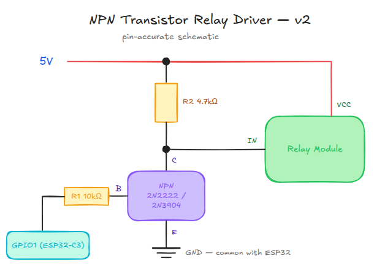

# Driving an active-low, 5V-threshold relay module from a 3.3V GPIO

## When you need this

Some relay modules are **active-low** (LOW = energized) but their input
buffer's "HIGH" threshold sits close to 5V — the ESP32-C3's 3.3V GPIO
output doesn't clear that threshold, so the module reads it as LOW-ish
and the relay stays energized regardless of what the firmware writes.
Confirmed by hand-testing: GND → active, 3.3V → still active, 5V → idle.

If you only have this module type in stock, don't try to fight it in
software (`RELAY_ACTIVE_LOW` in `door_control.py` can't fix a threshold
problem, only a polarity one) — add a one-transistor level shifter
between the GPIO and the relay's signal pin.

## Circuit: NPN inverting level shifter

This both inverts the logic and re-references it to 5V, which happens to
be exactly what an active-low/5V-threshold module needs from a 3.3V
active-high-style GPIO drive:



```
5V ──┬─────────────┐
     │             │
   [R2 4.7kΩ]       │
     │             │
     ├──────────── Relay module IN pin
     │
   Collector
     │
NPN (e.g. 2N2222 / 2N3904)
     │
   Emitter ── GND (common with ESP32 GND)

     Base
     │
   [R1 10kΩ]
     │
GPIO1 (ESP32-C3)
```

- **R1** (~10kΩ): GPIO1 → transistor base. Limits base current.
- **R2** (~4.7kΩ): 5V → transistor collector, and collector → relay IN
  pin. Pulls the relay's IN pin to a clean 5V when the transistor is off.
- **Emitter** → GND, shared with the ESP32's GND (common ground is
  required for any level shifter to work).
- Relay module's own VCC still needs its 5V supply as usual — this
  circuit only touches the IN/signal line.

### Truth table

| GPIO1 | Transistor | Collector / relay IN | Relay module (active-low) |
|---|---|---|---|
| LOW (0V) | off | pulled to 5V by R2 | idle (5V clears its HIGH threshold) |
| HIGH (3.3V) | on, saturated | pulled to ~0V (GND) | active (true LOW) |

Net effect: GPIO1 HIGH → relay energized, GPIO1 LOW → relay idle — i.e.
from the firmware's point of view this behaves exactly like an
**active-high** relay. No `door_control.py` changes needed beyond the
default `RELAY_ACTIVE_LOW = False`.

## 5V source

Use the board's own 5V input rail (USB VBUS on M5Stamp-C3U / Super
Mini) rather than a separate supply, so there's no ground-loop or
power-sequencing issue. Confirm your specific board exposes a 5V pin —
check the pinout in `docs/reference/firmware.md`.

## Verify before trusting it

Same manual poke test as any new relay wiring: with the transistor
circuit wired but the ESP32 GPIO left floating/disconnected, touch the
relay's IN pin briefly to 3.3V, 5V, and GND directly to sanity-check the
module's own thresholds haven't changed. Then wire the GPIO through R1
and re-run the open/close cycle test from
[`docs/how-to/flash-and-install.md`](../how-to/flash-and-install.md)
step 4, watching the relay's onboard LED for a clean idle → active →
idle transition.

## Alternative

If you'd rather not hand-solder a transistor per device, a small
MOSFET-based bidirectional logic level shifter module (3.3V ↔ 5V) does
the same job non-inverting — in that case set `RELAY_ACTIVE_LOW = True`
in `door_control.py` instead, since the level shifter passes polarity
through unchanged and the module itself is still active-low.
