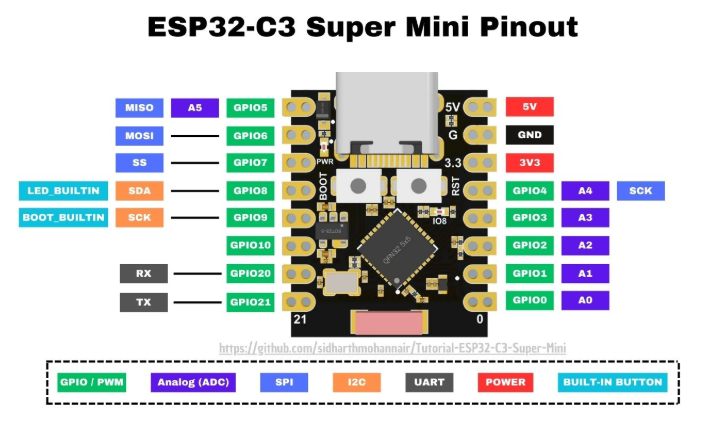

# Firmware reference

## Hardware (M5Stamp-C3U, or generic ESP32-C3 Super Mini — same SoC)



| Peripheral | Pin | Notes |
|---|---|---|
| Relay | GPIO 5 | `1` = door open, `0` = closed; starts closed. Requires an **active-high** relay module (see note below) |
| Push-button | GPIO 9 | Internal pull-up, falling-edge IRQ, 300 ms debounce |
| NeoPixel | GPIO 2 | 1 LED |
| Relay 2 (planned) | GPIO 6 | Reserved, not implemented yet |

## Files

| File | Purpose |
|---|---|
| `boot.py` | Forces relay closed, 3 s grace window (safe-mode button / mpremote access), connects WiFi, then hands off to `main.py` |
| `main.py` | Main loop: watchdog, health checks, door timeout |
| `door_control.py` | Relay + NeoPixel + physical button |
| `wifi_manager.py` | WiFi connect/reconnect with exponential backoff |
| `url_client.py` | Polls the backend, verifies the pairing signature |
| `credentials.example.py` | Template for WiFi + pairing settings |
| `install.py` | Uploads all `.py` files via `mpremote` |
| `firmware/flash.py`, `firmware/*.bin` | MicroPython image + flash script |

## `credentials.py` settings

| Setting | Meaning |
|---|---|
| `WIFI_SSID`, `WIFI_PASSWORD` | WiFi network to join |
| `DOOR_SERVER_URL` | Paired backend, no trailing slash (e.g. `https://door.example.org`) |
| `DEVICE_ID` | This device's id as registered on the backend |
| `DEVICE_SECRET` | Shared secret issued at registration; never sent over the wire |

## Wire protocol (`/check` polling)

Request, every 3 s:

```
GET {DOOR_SERVER_URL}/check?device_id={DEVICE_ID}&nonce={16-hex-char random}
User-Agent: CHB Door (ESP32-C3)
```

Expected response (HTTP 200 to open, 403 when closed):

```json
{"status": "open" | "closed", "sig": "<hex>"}
```

where `sig = HMAC-SHA256(DEVICE_SECRET, "<nonce>:<status>")`, hex-encoded.
The relay fires only when `status == "open"` **and** the signature
verifies. A 200 without a valid signature is logged
(`WARNING: got HTTP 200 without a valid signature`) and ignored.

## Timings

| What | Value | Where |
|---|---|---|
| Boot grace window (mpremote access / safe-mode button) | 3 s | `boot.py` |
| Backend poll interval | 1 s sleep (+ ~1.3 s HTTPS overhead ≈ 2.3 s real cadence) | `url_client.py` `check_interval` |
| Request timeout | 5 s | `url_client.py` `timeout` |
| Door auto-close | 3000 ms, fixed — repeat "open" signals while already open are ignored, not extended | `door_control.py` `DOOR_OPEN_DURATION` / `open_door()` |
| Door-timeout check | every 100 ms | `main.py` main loop |
| System health check | every 30 s | `main.py` `HEALTH_CHECK_INTERVAL` |
| Hardware watchdog | 30 s | `main.py` `machine.WDT` |
| Maintenance reboot | every 24 h | `main.py` `SystemManager` |
| WiFi reconnect backoff | 1 s → 60 s, reset after 10 attempts | `wifi_manager.py` |

## NeoPixel codes

| Color | Meaning |
|---|---|
| Blue (pulsing) | Connecting to WiFi |
| Red | Connected, door closed |
| Green | Door open |

## Relay module polarity

`door_control.py` drives GPIO5 with a `RELAY_ACTIVE_LOW` flag
(default `False`) instead of writing raw pin values, because relay
modules vary and this is a classic wiring trap:

- **Active-high modules** trigger on 3.3V/HIGH and idle on 0V/LOW — this
  is what the ESP32-C3 can drive directly and what this firmware assumes
  by default.
- **Active-low modules** trigger on LOW and need a solid HIGH (often
  close to 5V) to register idle. Many cheap bare-transistor relay boards
  fall in this category, and their "HIGH" threshold sits *above* the
  ESP32-C3's 3.3V GPIO output — so 3.3V reads as ambiguous/LOW to them
  and the relay stays permanently energized no matter what the firmware
  writes. There is no code fix for this: either use a level shifter to
  drive true 5V logic, or swap in an active-high (3.3V-logic-compatible)
  module.

**Before wiring a new relay module**, verify its trigger polarity by hand:
disconnect the ESP32, then briefly touch the module's signal (IN) pin to
3.3V, 5V, and GND in turn (module still powered) and observe which
levels engage the relay. Set `RELAY_ACTIVE_LOW` in `door_control.py` to
match, and confirm the module also reads a 3.3V HIGH cleanly if you're
using active-high — some modules need the full 5V rail even to trigger.

## Failure behavior

- WiFi lost → door forced closed, reconnect with backoff; reboot after 5
  failed reconnect cycles.
- Any error in the main loop → door forced closed.
- Watchdog not fed for 30 s → hardware reset.
